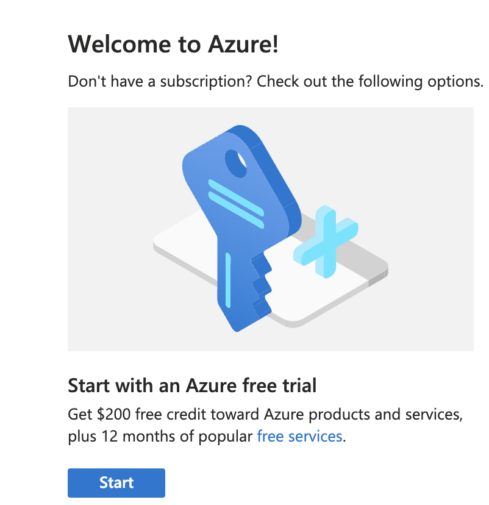
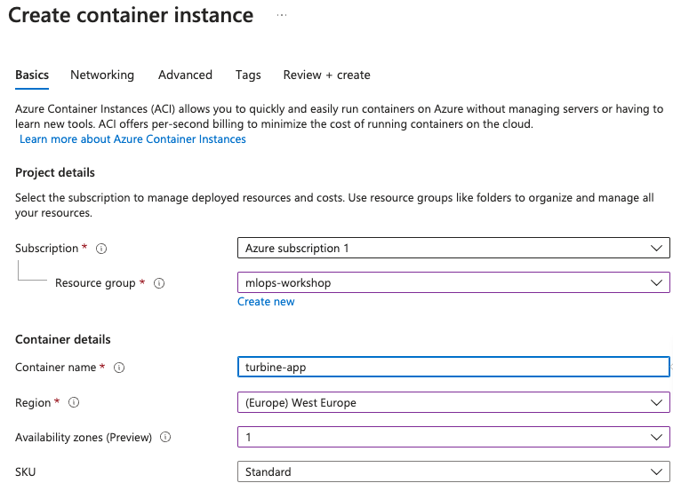
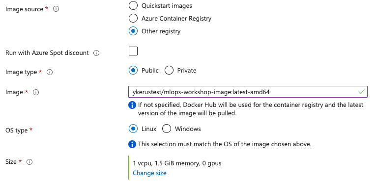
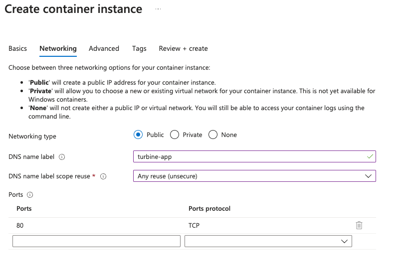
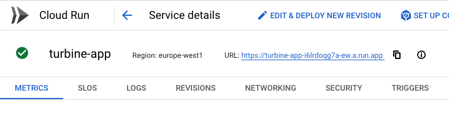
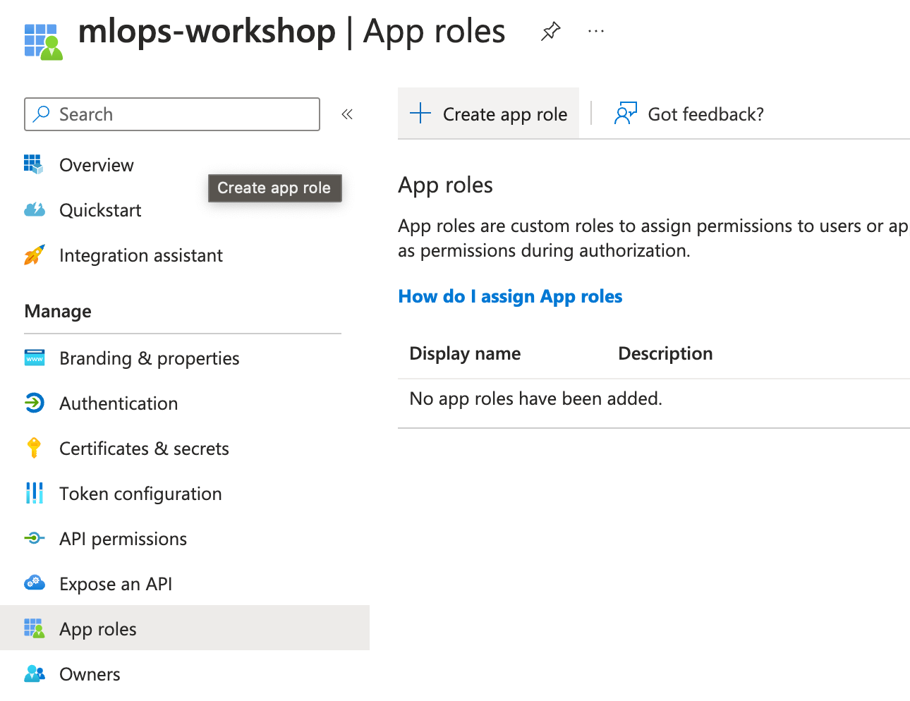
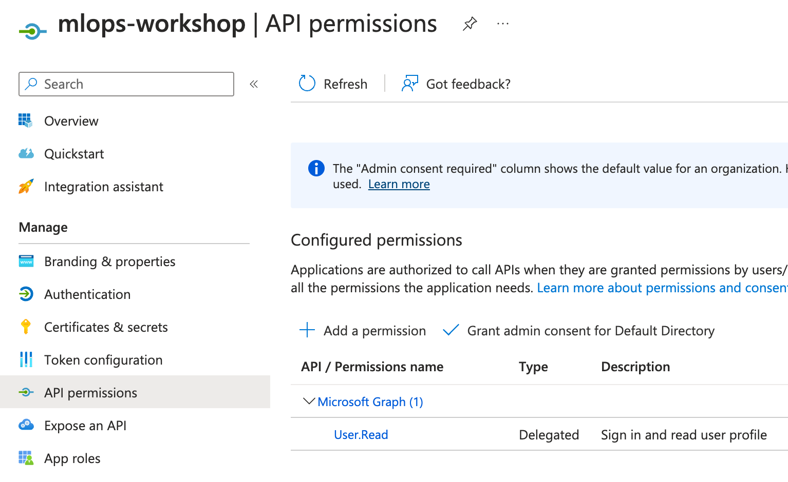
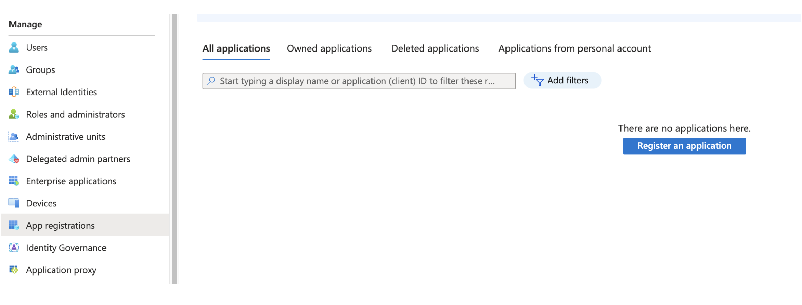
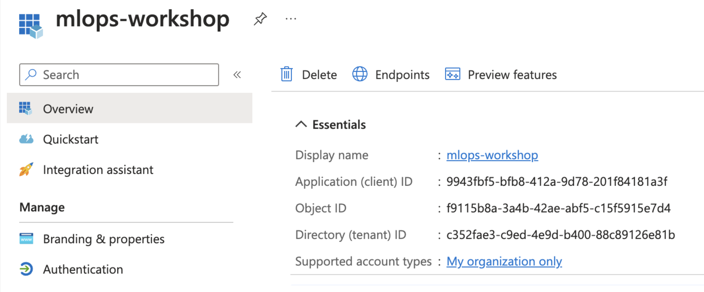
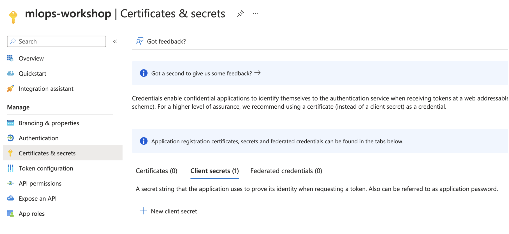

# Experiment Tracking with MLflow 📈

Interactive guide to experiment tracking with MLflow.

[](https://colab.research.google.com/github/dunnkers/experiment-tracking-with-mlflow/blob/main/notebooks/mlflow-demo.ipynb)


## Deployment 🚀

### Register container on Docker Hub 🌐

If we want to host our container somewhere we first need a place to store our image so it's accessible from the internet.
We can use a container registry for this.
In this workshop, we will use [Docker Hub](https://hub.docker.com/) to store our container images. Most cloud providers also offer a container registry, but Docker Hub is free and easy to use.


1. Go ahead and login or create an account on [Docker Hub](https://hub.docker.com/).
2. You can choose a Personal plan which is free, and allows you to create public repositories to store your container images.
3. Once you're logged in, you can create a new repository by clicking on the `Create Repository` button.
4. Give your repository a name (e.g. `mlops-workshop-image`), and make sure to set it to `Public`.
5. Now, from your terminal, login to Docker Hub using:
```bash
docker login --username=<your-username> --
```
1. Tag the image we've created earlier with your Docker Hub username:
```bash
docker tag mlops-workshop-image:latest <your-username>/mlops-workshop-image:latest
```
1. Push the image to Docker Hub:
```bash
docker push <your-username>/mlops-workshop-image:latest
```
1. You should now see your image on Docker Hub!


<!-- #TODO PREP: add m1 series adjustments -->

### Choose a cloud provider for deployment 🤔

Now, we need a place to host our container.
However, we don't want to manage our own servers (I only brought my laptop 🤷), so we will have to use a cloud provider to host our container.

There are many providers to choose from. Just to name a few:
- [Azure](https://azure.microsoft.com/en-us/)
- [Google Cloud](https://cloud.google.com/)
- [AWS](https://aws.amazon.com/)
- [Digital Ocean](https://www.digitalocean.com/)
- [IBM Cloud](https://www.ibm.com/cloud/)
- [Oracle Cloud](https://www.oracle.com/cloud/)
- [Alibaba Cloud](https://www.alibabacloud.com/)
- [Linode](https://www.linode.com/)
- [Vultr](https://www.vultr.com/)
- [Heroku](https://www.heroku.com/)

For this workshop, we have extensively worked out the steps for **Azure** and **Google Cloud (GCP)**, but similar steps should be possible for other cloud providers as well.

However, the challenge for today is that most, if not all, require you to enter your credit card details to get started.

Some of them offer a free trial or ~200 euro free credit, but you still have to enter your credit card details to get started...

That's why for this workshop, you can choose from these options:
1. Use your company's cloud provider account, if you have enough permissions in there to spin up a container instance.
2. (recommended) Create a new account on a cloud provider of your choice, and enter your credit card details. You can always delete your account afterwards. 
3. Collaborate with someone next to you who went for option 1 or 2 above.
4. Listen in and follow along as we deploy *your* container to the cloud on the big screen.

In the following, we describe the steps for deployment on Azure and GCP, assuming we start with a fresh account. We will deploy our app first through the cloud provider's user interface (UI), and then through the command line interface (CLI) from our local machine.

### Deploy container on Azure ☁️

#### 1. Deploy using the UI 🖥️

1. Go to the [Azure portal](https://portal.azure.com/) and login or create an account.
2. Get your 200$ free credit
- 
3. In the portal menu, navigate to `Container Instances`.

1. Click on `Create` to create a new container instance.
2. In the Basic configuration:
   - Select or create a new resource group (e.g. `mlops-workshop`).
   - Give your app a name (e.g. `turbine-app`).
   - Select a region: `West Europe`.
   - And availability zones: 1.
   - Load in your image from Docker Hub!
     - Select `Other registry` as the image source.
      - Fill in your Docker Hub location (e.g. `<your-dockerhub-username>/mlops-workshop-image:latest`). <!-- #TODO PREP: m1 variant -->




6. In the Networking configuration: <!-- #TODO PREP: change port -->
    - Select `Public` for the networking type to make our app accessible from the internet.
    - Use a DNS name label, which will be used as part of our url (e.g. `turbine-app-<your-name>`).
    - To get a smooth url (e.g. `turbine-app-<your-name>.westeurope.azurecontainer.io`), set the DNS name label scope reuse to `Any reuse (unsecure)`. This is fine for our workshop, but this is not generally recommended as it's less secure.
    - Set the port to `8080`, in line with our `Dockerfile`.


7. And create your container instance!

8. Check the status of your container instance. It should be `Running` after a few minutes. You can select `Go to resource` or navigate to the overview [here](https://portal.azure.com/#view/HubsExtension/BrowseResource/resourceType/Microsoft.ContainerInstance%2FcontainerGroups) and click on your container instance.

9. You can now access your app through the url that was generated for you (e.g. `turbine-app-<your-name>.westeurope.azurecontainer.io`). You can also find the applicatin url when you click on your container instance. Let your neighbour also try to access your app!

10. You may clean up your app by deleting the container instance. You can do this by clicking on `Delete` in the overview of your container instance. By doing so, we can reuse the app name in the next section.

#### 2. Deploy using the Azure CLI 🧑‍💻

1. Make sure you have the Azure CLI installed. You can find the instructions [here](https://docs.microsoft.com/en-us/cli/azure/install-azure-cli).
2. Open a terminal and login to Azure by running:
```bash
az login
```

3. Deploy your container instance with a single line:
```bash
az container create --name turbine-app --resource-group mlops-workshop --image <your-dockerhub-image-location> --dns-name-label turbine-app-<your-name> --ports 8080 --ip-address public
```
- You are free to change the specific names you to what you've used throughout the workshop, but make sure to change `<your-dockerhub-image-location>` (e.g. `<your-dockerhub-username>/mlops-workshop-image:latest`) and `turbine-app-<your-name>`.


4. If you want to update your container instance with a new image, you can run:
```bash
az container update --name turbine-app --resource-group mlops-worshop --image <your-dockerhub-image-location>
``` 
 
1. Your app is running 🚀 Now, let your neighbour try to access your app!

### Deploy container on GCP ☁️

#### 1. Deploy using the UI 🖥️

1. Go to the [GCP console](https://console.cloud.google.com/) and login or create an account.

2. Create a new project (e.g. `mlops-workshop`).
3. Activate your trial to get 275$ for free. If you can't find the option, you navigate to the [resource manager](https://console.cloud.google.com/cloud-resource-manager) where you can select "Billing" from the options next to your project name. Set up your billing account and activate your trial.


1. Now navigate to Cloud Run from the top menu
2. Click on "Create Service"
3. Configure the service:
   - Fill in the Container image URL (e.g. `docker.io/<your-dockerhub-username>/mlops-workshop-image:latest`).
   - Choose a name for your app (e.g. `turbine-app`).
   - Set the region to `europe-west1`.
   - Set ingress controll to `All`.
   - And under Authentication, select `Allow unauthenticated invocations`. 
   - If at any point you get a warning that you need to enable the Cloud Run API, click on the link to enable it.


<!-- #TODO PREP: add screenshots -->

4. Create your service!
5. Check the status of your service. It should be deployed after a few minutes. You can select `Go to service` or navigate to the overview [here](https://console.cloud.google.com/run) and click on your service.

6. You can now access your app through the URL that was generated for you, which you can find when you click on your service. Let your neighbour also try to access your app!


7. You may clean up by selecting your service and clicking `Delete` in the Cloud Run overview.


#### 2. Deploy using the CLI 🧑‍💻

1. Make sure you have the GCP CLI installed. You can find the instructions [here](https://cloud.google.com/sdk/docs/install).
2. Open a terminal and login to GCP by running:
```bash
gcloud auth login
```
3. For the next steps, it may be necessary to create a new project from the CLI. You can do this by running:
```bash
gcloud projects create mlops-workshop-project
```
1. Now in the UI, we can navigate to the [resource manager](https://console.cloud.google.com/cloud-resource-manager) again to set up billing for this project. Reuse the billing account you created before.


1. In your terminal, configure your CLI to your project and region:
```bash
gcloud config set project mlops-workshop-project
gcloud config set run/region europe-west1
```

1. Now, deploy your container with a single line:
```bash
gcloud run deploy turbine-app --image <your-dockerhub-image-location> --allow-unauthenticated --platform managed
```

- You can run the same line to update your container instance with a new image.

4. Your app is running 🚀 Now, let your neighbour try to access your app!


### >>> TODO PREP: Add instructions for M1 series 

- we've created a container with

build using: docker build -t mlops-workshop-image:latest .
run using: docker run -p 80:80 mlops-workshop-image:latest

- note: if you're on mac M-series, you probably want to run:
```bash
docker build --platform linux/amd64 -t mlops-workshop-image:latest-amd64 .
```

and use this image in all subsequent steps

## Troubleshoot

If container doesn't start, the mlflow server may be broken.


## Bonus: CI/CD with GitHub Actions

1. Inspect files

2. 
In settings, select 


Add New Repository Secret

1. Add dockerhub secrets

2 Create and merge a pull request






Finding secrets for Azure:
- Go to portal (portal.azure.com)
- Navigate to Active Directory from the top menu
- Select App Registrations from the left menu and create a new app registration if there is none

- Once created, you can copy the tenant ID. Register this as a secret in your GitHub repository under the name `AZURE_TENANT_ID`.

- Create secret in your app registration

- Once created, you can copy the client ID and value. Register these as the secrets `AZURE_CLIENT_ID` and `AZURE_CLIENT_SECRET` in your GitHub repository.
- Finally, you can find the subscription ID [here](https://portal.azure.com/#view/Microsoft_Azure_Billing/SubscriptionsBlade). Register this as the secret `AZURE_SUBSCRIPTION_ID` in your GitHub repository.

Finding secrets for GCP:
- Go to the [GCP console](https://console.cloud.google.com/)
- Navigate to IAM & Admin from the top menu
- Go to Service Accounts from the left menu
- Click on Create Service Account
- Give it a name and access rights (e.g. Cloud Run Admin)
- Once created, click on the options next to the service account and select Manage Keys
- Click Create New Key and select JSON
- A file will be downloaded. Copy its content into a GitHub secret called `GCP_SERVICE_ACCOUNT_KEY`.

Tada!


test
