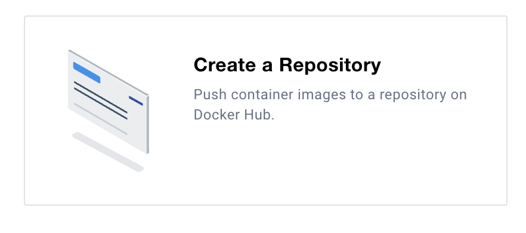

# Register container image on Docker Hub 🌐

Similar to how we register a model after training it, we can register a container image after building it.
We can use Docker Hub to register our container images. Most cloud providers also offer a container registry, but Docker Hub is free and easy to use.

Registering our image allows other people, or other systems, to pull our container image and run it elsewhere.

## Steps

1. Login or create an account on Docker Hub: [https://hub.docker.com/](https://hub.docker.com/)
2. You can choose a Personal plan, which is free, and allows you to create public repositories to store your container images.
3. Create a new repository (e.g. `turbine-image`) and set it to Public.


4. Now, from your terminal, login to Docker Hub using:
```bash
docker login --username=<your-username> --
```
5. Rebuild the image with a tag (`-t`) that tells docker where to push the image to, and a configuration (`--platform`) that makes the image compatible with the systems that we want to run it on.
```bash
docker build -t <your-dockerhub-username>/turbine-image:latest --platform linux/amd64 .
```

6. Push the image to Docker Hub:
```bash
docker push <your-dockerhub-username>/turbine-image:latest
```
7. You can now check your image on Docker Hub: [https://hub.docker.com/](https://hub.docker.com/) 🎉

