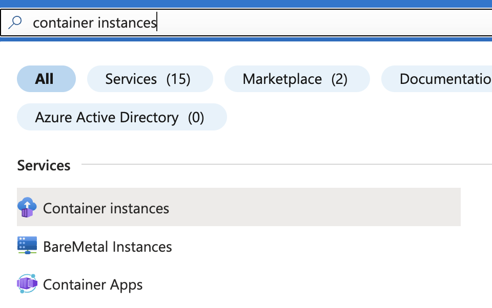

# Deploy container on Azure 🚀

## 1. Deploy using the UI 🖥️

1. Go to the [Azure portal](https://portal.azure.com/) and login or create an account.
2. Get your 200$ free credit

3. In the portal menu, navigate to `Container Instances`.

4. Click on `Create` to create a new container instance.
5. In the Basic configuration:
   - Select or create a new resource group (e.g. `mlops-tutorial`).
   - Give your app a name (e.g. `turbine-app`).
   - Select a region: `West Europe`.
   - And availability zones: 1.
   - Load in your image from Docker Hub:
     - Select `Other registry` as the image source.
     - Fill in your Docker Hub location (e.g. `<your-dockerhub-username>/turbine-image:latest`).

6. In the Networking configuration: 
    - Select `Public` for the networking type to make our app accessible from the internet.
    - Use a DNS name label, which will be used as part of our URL (e.g. `turbine-app-<your-name>`).
    - To get a nice url (e.g. `turbine-app-<your-name>.westeurope.azurecontainer.io`), set the DNS name label scope reuse to `Any reuse (unsecure)`. This is fine for this tutorial, but this is not generally recommended as it's less secure.
    - Set the port to `8080`, in line with what we specified in our `Dockerfile`.

7. Create your container instance!

8. Check the status of your service. It should be running after a few minutes. You can select "Go to resource" or navigate to the overview [here](https://portal.azure.com/#view/HubsExtension/BrowseResource/resourceType/Microsoft.ContainerInstance%2FcontainerGroups) and click on your container instance.

9. You can now access your app through the url that was generated for you (e.g. `turbine-app-<your-name>.westeurope.azurecontainer.io`). You can also find the application URL when you click on your container instance. 

> **Note:** If it doesn't work, you may need to add the port to the url (e.g. `turbine-app-<your-name>.westeurope.azurecontainer.io:8080`).

10. It works! 🎉 Now let your neighbour also try to access your app!

11.  Clean up your app by deleting the container instance. You can do this by clicking on "Delete" in the overview of your container instance. If you do this, you can use the same app name in the next section.

## 2. Deploy using the Azure CLI 🧑‍💻

1. Make sure you have the Azure CLI installed. You can find the instructions [here](https://docs.microsoft.com/en-us/cli/azure/install-azure-cli).
2. Open a terminal and login to Azure by running:
```bash
az login
```

3. Deploy your container instance with a single command:
```bash
az container create \
  --name turbine-app \
  --resource-group mlops-tutorial \
  --image <your-dockerhub-username>/turbine-image:latest \
  --dns-name-label turbine-app-<your-name> \
  --ports 8080 \
  --ip-address public
```
- Fill in `<your-dockerhub-username>` and `<your-name>`.
 

4. Check the status of the instance, you can do so by running:
```bash
az container show \
  --name turbine-app \
  --resource-group mlops-tutorial \
  --query "{FQDN:ipAddress.fqdn,ProvisioningState:provisioningState}" \
  --out table
```

5. Your app is running 🚀 Now, try to access it the same way as before!


6. Clean up the app using:
```bash
az container delete \
  --name turbine-app \
  --resource-group mlops-tutorial
```
